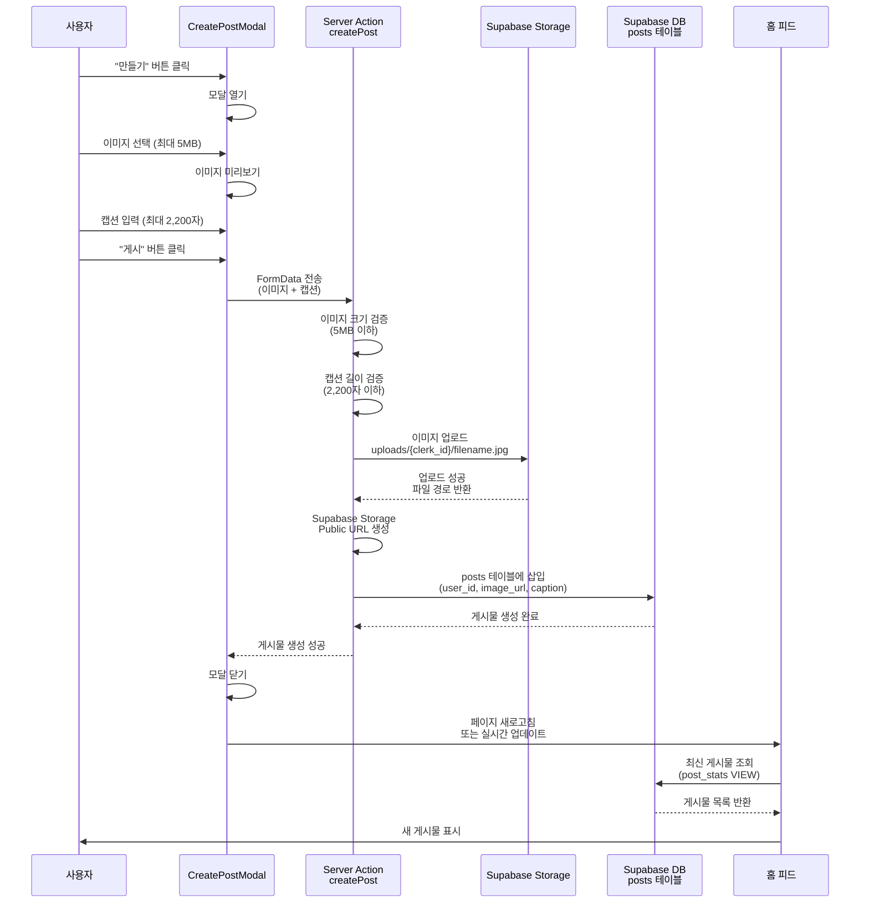

# 게시물 작성 플로우 (Create Post Flow)

이 문서는 게시물 작성 과정의 상세한 시퀀스 다이어그램을 제공합니다.

## 다이어그램

## 설명

이 플로우는 사용자가 게시물을 작성할 때 발생하는 모든 단계를 보여줍니다.

### 주요 단계

1. **UI 인터랙션**: 모달 열기, 이미지 선택, 캡션 입력
2. **검증**: 이미지 크기(5MB), 캡션 길이(2,200자) 검증
3. **이미지 업로드**: Supabase Storage에 파일 업로드
4. **데이터 저장**: posts 테이블에 게시물 정보 저장
5. **UI 업데이트**: 홈 피드에 새 게시물 표시

## 관련 파일

- `components/post/CreatePostModal.tsx` - 게시물 작성 모달 컴포넌트
- `actions/post.ts` - createPost Server Action
- `actions/storage.ts` - uploadFile Server Action
- `supabase/migrations/20251104172452_create_sns_tables.sql` - posts 테이블 정의

