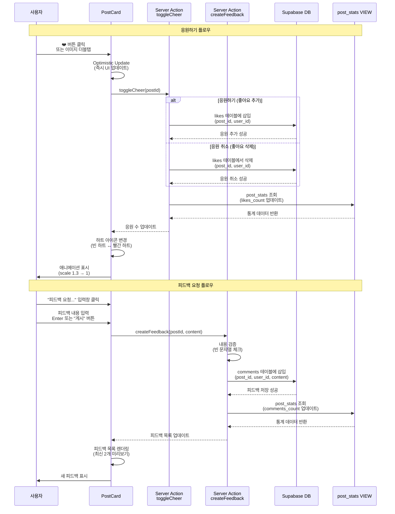

# 응원하기 & 피드백 플로우 (Cheer & Feedback Flow)

이 문서는 응원하기(좋아요)와 피드백 요청(댓글) 기능의 상세한 시퀀스 다이어그램을 제공합니다.

## 다이어그램

## 설명

이 플로우는 게시물에 대한 응원하기(좋아요)와 피드백 요청(댓글) 기능의 상호작용을 보여줍니다.

### 응원하기 플로우

1. **사용자 액션**: 하트 버튼 클릭 또는 이미지 더블탭
2. **Optimistic Update**: 즉시 UI 업데이트 (사용자 경험 개선)
3. **데이터베이스 업데이트**: likes 테이블에 추가/삭제
4. **통계 갱신**: post_stats VIEW에서 응원 수 조회
5. **UI 피드백**: 하트 아이콘 변경 및 애니메이션

### 피드백 요청 플로우

1. **입력**: 피드백 내용 입력
2. **검증**: 빈 문자열 체크
3. **데이터 저장**: comments 테이블에 저장
4. **통계 갱신**: post_stats VIEW에서 피드백 수 조회
5. **UI 업데이트**: 피드백 목록에 새 항목 표시

## 관련 파일

- `components/post/PostCard.tsx` - 게시물 카드 컴포넌트
- `components/post/CheerButton.tsx` - 응원하기 버튼 컴포넌트
- `components/feedback/FeedbackForm.tsx` - 피드백 작성 폼
- `components/feedback/FeedbackList.tsx` - 피드백 목록 컴포넌트
- `actions/cheer.ts` - toggleCheer Server Action
- `actions/feedback.ts` - createFeedback Server Action
- `supabase/migrations/20251104172452_create_sns_tables.sql` - likes, comments 테이블 정의

