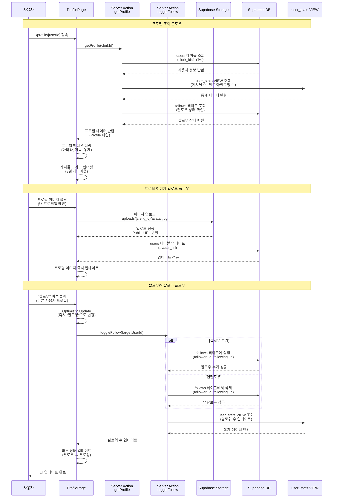

# 프로필 & 팔로우 플로우 (Profile & Follow Flow)

이 문서는 프로필 조회, 프로필 이미지 업로드, 팔로우/언팔로우 기능의 상세한 시퀀스 다이어그램을 제공합니다.

## 다이어그램

## 설명

이 플로우는 프로필 페이지의 모든 주요 기능을 보여줍니다.

### 프로필 조회 플로우

1. **라우팅**: `/profile/[userId]` 접속
2. **데이터 조회**: users 테이블에서 사용자 정보 조회
3. **통계 조회**: user_stats VIEW에서 게시물 수, 팔로워/팔로잉 수 조회
4. **팔로우 상태 확인**: 현재 사용자가 해당 프로필을 팔로우하는지 확인
5. **UI 렌더링**: 프로필 헤더와 게시물 그리드 표시

### 프로필 이미지 업로드 플로우

1. **이미지 선택**: 프로필 이미지 클릭 (내 프로필만)
2. **업로드**: Supabase Storage에 이미지 업로드
3. **URL 생성**: Public URL 생성
4. **데이터 업데이트**: users 테이블의 avatar_url 업데이트
5. **즉시 반영**: 프로필 이미지 즉시 업데이트

### 팔로우/언팔로우 플로우

1. **Optimistic Update**: 즉시 UI 업데이트 (사용자 경험 개선)
2. **데이터베이스 업데이트**: follows 테이블에 추가/삭제
3. **통계 갱신**: user_stats VIEW에서 팔로워 수 조회
4. **UI 업데이트**: 버튼 상태 변경 (팔로우 ↔ 팔로잉)

## 관련 파일

- `app/(main)/profile/[userId]/page.tsx` - 프로필 페이지
- `components/profile/ProfileHeader.tsx` - 프로필 헤더 컴포넌트
- `components/profile/AvatarUpload.tsx` - 프로필 이미지 업로드 컴포넌트
- `components/profile/FollowButton.tsx` - 팔로우 버튼 컴포넌트
- `components/profile/PostGrid.tsx` - 게시물 그리드 컴포넌트
- `actions/profile.ts` - getProfile, uploadAvatar Server Actions
- `actions/follow.ts` - toggleFollow Server Action
- `supabase/migrations/20251104172452_create_sns_tables.sql` - users, follows 테이블 정의

