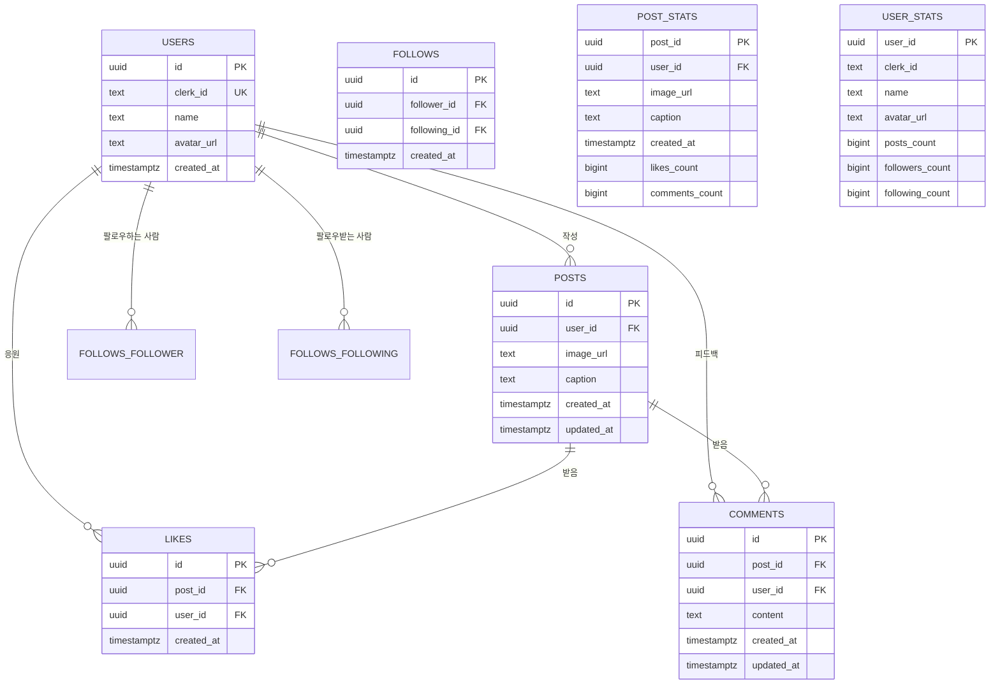

# 데이터베이스 관계 다이어그램 (Database ER Diagram)

이 문서는 Supabase 데이터베이스의 엔티티 관계 다이어그램을 제공합니다.

## 다이어그램

## 설명

이 다이어그램은 데이터베이스의 모든 테이블과 뷰, 그리고 그들 간의 관계를 보여줍니다.

### 주요 엔티티

1. **USERS**: 사용자 정보 (Clerk와 연동)
2. **POSTS**: 게시물 정보
3. **LIKES**: 응원하기 (좋아요) 정보
4. **COMMENTS**: 피드백 요청 (댓글) 정보
5. **FOLLOWS**: 팔로우 관계 정보

### 뷰 (Views)

1. **POST_STATS**: 게시물별 통계 (응원 수, 피드백 수)
2. **USER_STATS**: 사용자별 통계 (게시물 수, 팔로워 수, 팔로잉 수)

### 관계

- **USERS → POSTS**: 한 사용자는 여러 게시물 작성 가능 (1:N)
- **USERS → LIKES**: 한 사용자는 여러 게시물에 응원 가능 (1:N)
- **USERS → COMMENTS**: 한 사용자는 여러 피드백 작성 가능 (1:N)
- **USERS → FOLLOWS**: 한 사용자는 여러 사용자를 팔로우/팔로우받을 수 있음 (N:N)
- **POSTS → LIKES**: 한 게시물은 여러 응원을 받을 수 있음 (1:N)
- **POSTS → COMMENTS**: 한 게시물은 여러 피드백을 받을 수 있음 (1:N)

### 제약조건

- **LIKES**: `UNIQUE(post_id, user_id)` - 중복 응원 방지
- **FOLLOWS**: `UNIQUE(follower_id, following_id)` - 중복 팔로우 방지
- **FOLLOWS**: `CHECK (follower_id != following_id)` - 자기 자신 팔로우 방지

## 관련 마이그레이션 파일

- `supabase/migrations/20251104172452_create_sns_tables.sql` - 전체 테이블 및 뷰 정의
- `supabase/migrations/setup_schema.sql` - users 테이블 초기 설정
- `supabase/migrations/setup_storage.sql` - Storage 버킷 설정

