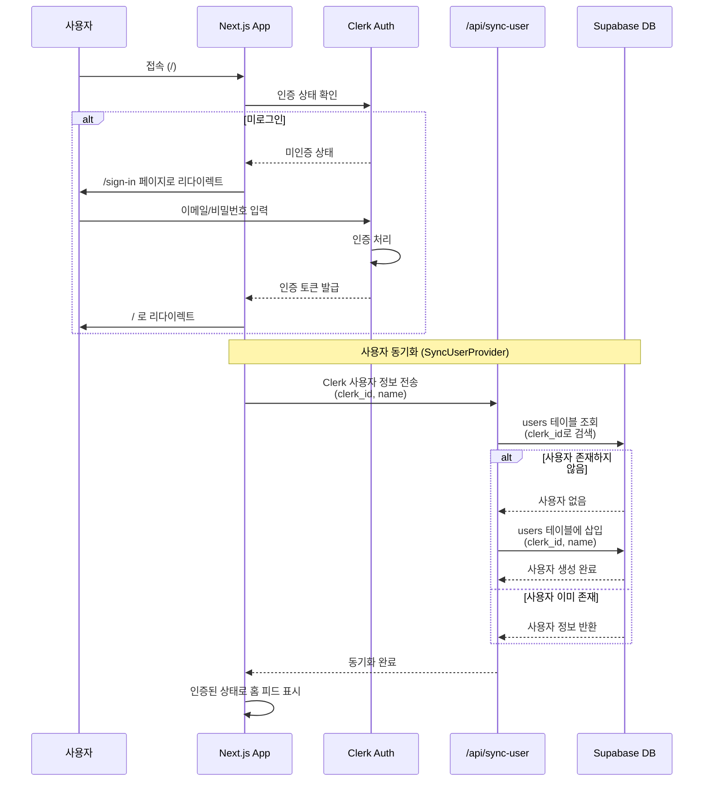

# 인증 플로우 (Authentication Flow)

이 문서는 Clerk 인증과 Supabase 사용자 동기화 과정의 상세한 시퀀스 다이어그램을 제공합니다.

## 다이어그램

## 설명

이 플로우는 사용자가 애플리케이션에 로그인하고, Clerk 인증 정보가 Supabase 데이터베이스와 동기화되는 전체 과정을 보여줍니다.

### 주요 단계

1. **인증 확인**: Clerk를 통해 현재 사용자의 로그인 상태 확인
2. **로그인 처리**: 미로그인 시 로그인 페이지로 리다이렉트
3. **사용자 동기화**: Clerk 사용자 정보를 Supabase users 테이블과 동기화
4. **신규 사용자 생성**: 처음 로그인한 사용자는 자동으로 users 테이블에 생성
5. **인증 완료**: 동기화 완료 후 홈 피드 표시

### 동기화 이유

- Clerk는 인증만 담당하고, 애플리케이션의 사용자 데이터는 Supabase에 저장
- posts, likes, comments 등 모든 테이블이 users 테이블의 id를 참조
- 사용자 프로필 정보(이름, 아바타)를 Supabase에서 관리

## 관련 파일

- `app/layout.tsx` - ClerkProvider, SyncUserProvider 설정
- `components/providers/sync-user-provider.tsx` - 사용자 동기화 프로바이더
- `app/api/sync-user/route.ts` - 사용자 동기화 API 라우트
- `hooks/use-sync-user.ts` - 사용자 동기화 훅
- `lib/supabase/clerk-client.ts` - Clerk와 연동된 Supabase 클라이언트
- `lib/supabase/server.ts` - 서버 사이드 Supabase 클라이언트
- `middleware.ts` - 인증 미들웨어
- `supabase/migrations/setup_schema.sql` - users 테이블 정의

